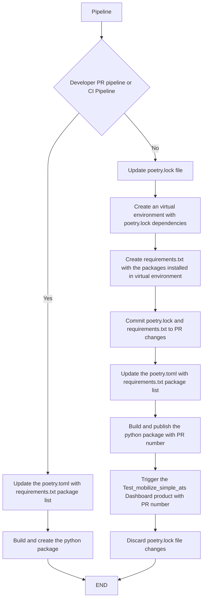
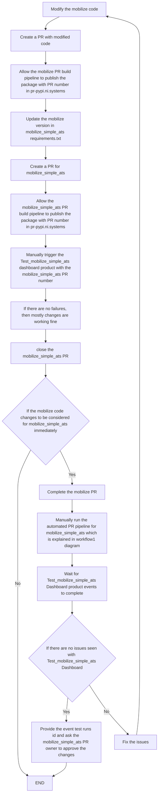
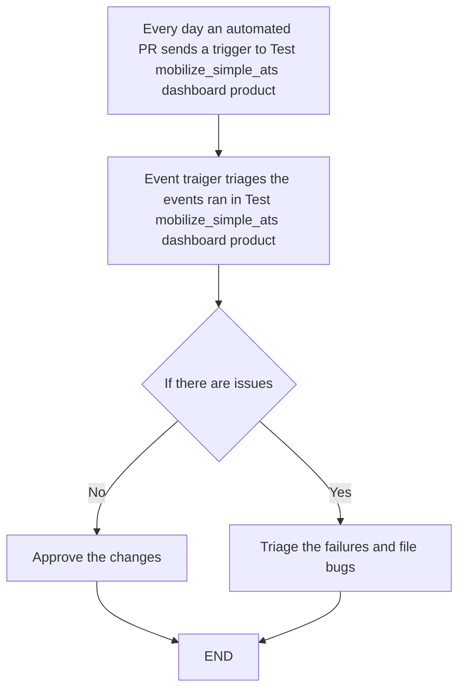

#  Solve python dependencies package issues for mobilize_simple_ats.

## Description
MTO clients ATSes are failing due to its python dependencies issues. Please refer theses posts which cased depenedency issues  [link1](https://teams.microsoft.com/l/message/19:9137171a59e64cc3abe59cc03c721a89@thread.skype/1651000074788?tenantId=87ba1f9a-44cd-43a6-b008-6fdb45a5204e&groupId=2818f1c0-5755-4595-9845-dab2ea03af96&parentMessageId=1651000074788&teamName=Measurement%20Test%20Operations%20%28Teams%20Group%20Only%20Don%27t%20Email%29&channelName=Testing&createdTime=1651000074788)(crypography issue), [link2](https://teams.microsoft.com/l/message/19:9137171a59e64cc3abe59cc03c721a89@thread.skype/1651859118744?tenantId=87ba1f9a-44cd-43a6-b008-6fdb45a5204e&groupId=2818f1c0-5755-4595-9845-dab2ea03af96&parentMessageId=1651859118744&teamName=Measurement%20Test%20Operations%20%28Teams%20Group%20Only%20Don%27t%20Email%29&channelName=Testing&createdTime=1651859118744)(cerberus issue), [link3](https://teams.microsoft.com/l/message/19:9137171a59e64cc3abe59cc03c721a89@thread.skype/1650299847686?tenantId=87ba1f9a-44cd-43a6-b008-6fdb45a5204e&groupId=2818f1c0-5755-4595-9845-dab2ea03af96&parentMessageId=1650299847686&teamName=Measurement%20Test%20Operations%20%28Teams%20Group%20Only%20Don%27t%20Email%29&channelName=Testing&createdTime=1650299847686)( mobilize issue). ATS clients will not encounter these issues if static list of dependencies is defined.

## 3 approaches to solve this dependency issue.
#### 1. [current approach] Keep the dynamic dependencies in mobilize_simple_ats: Do not keep the static list in its dependencies, fix the issues as and when something breaks in the client ATS. 
##### Pros:  
      a. Always mobilize_simple_ats is up to date with its dependencies.

##### Cons:
      a. ATS run is blocked during the issues.
      b. Unpredicted issues which might take high priority.
      c. Unncessary triaging efforts.
 

#### 2. Create static list of python dependencies in mobilize_simple_ats, upgrade the dependencies only if it is required. Test the changes before submitting the changes.
##### Pros:
         a. ATS run is not interrupted.
         b. No unpredicted issues.
  
##### Cons:  
         a. Mobilize_simple_ats does not have latest dependencies.
         b. May require too much effort during the update of its dependencies.
 

#### 3. Update the static list of python dependencies regularly (Frequency can be every day). Test the changes every time its dependencies got updated.
##### Pros:
         a. ATS run is not interrupted.
         b. No unpredicted issues.
         c. mobilize_simple_ats is up to date with working dependencies
  
##### Cons:  
         a. More resources are consumed for regular testing.

Efforts required to keep it up to date can be automated.

## Recommendation
Proposed solution is to use the approach 3(Update the static list of python dependencies regularly) with automated efforts for updating its dependencies.

## Implementation details for the recomended solution
This section discusses the approach 3 on how to automate the efforts required for regularly update the static list of mobilize_simple_ats dependencies.

1. Process of updating the static of dependencies is explained below. Below steps are executed in an automated PR pipeline.
    * Update the poerty.lock file
    * Create a virtual environment using the updated poetry.lock.
    * Capture the python dependencies using pip freeze (ignore moblize_simple_ats) in the requirements.txt.
    * Ignore if there is no update in requirements.txt otherwise
    * Commit the poetry.lock file and requirements.txt in the PR changes.
    * Update the poetry.toml [tool.poetry.dependencies] with requirements.txt package list.
    * Build and publish the package with PR number.
    * Discard the poetry.toml file changes.
    * Trigger the “Test_mobilize_simple_ats” Dashboard product with PR number. 

2. Create the Test Dashboard product.
    * Create a new product called “Test_mobilize_simple_ats” Product in dashboard.
    * Create test suites for all the supporting OS (Windows, Linux RT, Linux (RHEL, OpenSuse, Ubuntu etc.)
    * Create events for the above test suites created.
    * Test event should rypc.bootstrap, install LabVIEW, drivers, simulate the hardware, run the basic tests using test runners like Arcadia,  TCAT, gtest e.t.c. 
    * Test events should use mobilize_simple_ats version which is created using the PR. There are two possible solutions to use the mobilize_simple_ats==PR_VERSION in the test event.
        * Before the events are triggered, regenerate the events mako file with mobilize_simple_ats==PR_VERSION (Package Name).
        * Use wrapper package in “Package Name" which will install mobilize_simple_ats based on the PR number(%system.BuildPath%).

##  Workflow1 diagram for mobilize_simple_ats PR.

##  Workflow2 diagram for developers to test the PR changes. In this workflow, developer has made some changes in mobilize code.

##  Workflow3 diagram for Test_mobilize_simple_ats Dashboard product events traigers.

